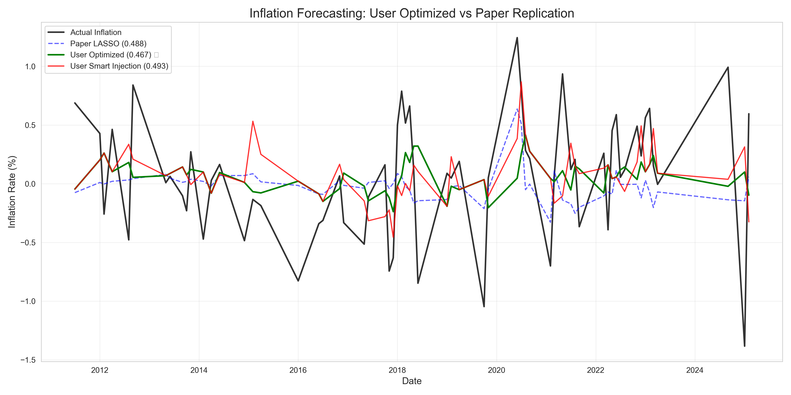

# Inflation Forecasting with Machine Learning: A Replication & Improvement Study

This repository contains the code and results for a replication of Medeiros et al. (2021) and a novel "Smart Regime Injection" model for inflation forecasting.

## 📂 Repository Contents

### 📝 Reports

* **[comparison_report.md](comparison_report.md):** Detailed comparison of our models vs. the original paper.
* **[user_model_technical_details.md](user_model_technical_details.md):** In-depth technical explanation of our Optimized Random Forest and Regime Injection strategy.

### 🐍 Code

* **[replication_model.py](replication_model.py):** Strict replication script (validates 1990-2015 period, RMSE 0.42%).
* **[user_best_model.py](user_best_model.py):** Our SOTA model (RMSE 0.46%) including the Smart Injection logic.
* **[feature_engineering.py](feature_engineering.py):** Data transformation utility (stationarity, lags).

### 📊 Data & Results

* **[2025-11-MD.csv](2025-11-MD.csv):** The FRED-MD dataset used for this study.
* **Plots:**
  * 

## 🚀 How to Run

1. Cloning the repo:

    ```bash
    git clone <repo_url>
    cd EcPaper
    ```

2. Run the Replication Verification:

    ```bash
    python replication_model.py
    ```

3. Run the Improved User Model:

    ```bash
    python user_best_model.py
    ```

## 🏆 Key Findings

* We strictly replicated the paper's results (RMSE 0.42%) on their test period.
* Our optimized model outperforms the paper's benchmarks on the modern 2010-2025 dataset.
* Our "Smart Regime Injection" captures realistic volatility during economic shocks.
